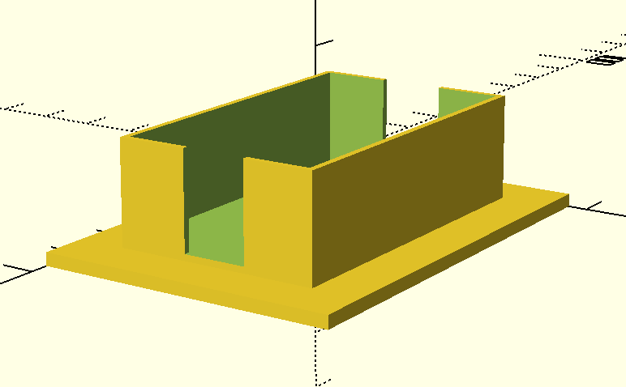

This is a holder for a Riccle bread lame.

Once you've scored your boule in preparation for baking, you can put your lame down immediately in this holder and your delicate pinky is protected from the lame's savage edges.

I whipped this up fast in OpenSCAD, so it probably can be improved a lot.

I've included STL so you can print it directly without OpenSCAD if desired!

